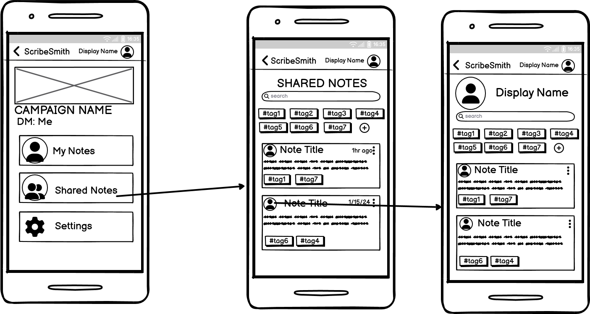

# ScribeSmith
Our proposal for the group project is ScribeSmith: a note taking app designed specifically for tabletop role playing games (TTRPGs). 

## Problem Statement
Players of tabletop roleplaying games have to keep track of a lot of information, particularly if they are the GM (game master) in charge of running the game. Players may wish to take detailed notes on the events of each session, have notes on each non-player character they have met, or track which magic items and equipment are in their backpack. GMs need to manage even more including enemy statistics, plans for future sessions, and information about any characters the party might run into. It can become very difficult to track all of your notes in a way that allows them to be referenced during a play session without slowing down the game, especially when sharing between players is involved. 

## Our Solution
ScribeSmith will meet these needs by providing one easily searchable place to store all of your campaign notes. ScribeSmith will be GM-led, allowing GMs to create campaigns for their players to join and giving them extra administrative privileges to help them execute their campaign. Within a campaign, GMs and players alike can create notes with rich text and/or uploaded images. Notes can be filtered with tags, making it very easy to quickly find the name of the barkeeper from last week: simply filter by #session2 and #npc. Notes can be shared to other people in the campaign. The GM can allow all the players to view the map they found, and the one player who takes very detailed notes can share them with the rest of the players.

## Data
Our app will need to store data on users, campaigns, and notes themselves. For the users, we will store a username, password, and list of campaign IDs. For the campaigns, we will store a name, system, description, banner image, list of campaign-global tags, owner (GM) username, campaign ID (join code), list of players, and list of notes. For each note, we will store an ID, title, the html of the note’s rich text, any uploaded files, as well as timestamps, tags, and sharing permissions. All of this data will either be generated by the system (IDs, timestamps) or typed/uploaded by users directly (everything else).

## Why a PWA?
ScribeSmith takes advantage of several PWA features including mobile-first design and offline functionality. During a play session it can be difficult to have every player taking notes on their laptops when the table is already filled with miniature dragon figures, dice trays, and battle maps. Since our app has mobile-first design, the table will be clear, as notes can easily be accessed on a smaller mobile device. Additionally, laptop compatibility will allow the GM to access their (more expansive) notes on a larger screen without using a separate platform. Offline functionality ensures you always have access to your notes, so you don’t have to cancel the session when the Wi-Fi goes down. A PWA is also a great choice over a native application because it is linkable, allowing players to share note URLs with each other across other platforms they already use for communication.

## Wireframes

### Wireframe set 1

Wireframe set 1 shows the flow of a log in, which takes the user to the **My Campaigns** home page. From there the user can navigate to a **Campaign**, which will have a slightly different display depending on whether that player is the GM. The GM can access the **Campaign Settings** page. 

### Wireframe set 2

Wireframe set 2 shows the flow of a user joining or creating a campaign. To join a campaign they enter a code. To create a campaign they enter a name, system, and description. Then a campaign code is generated which can be used by other users to join the campaign. After either of these actions are completed, the campaign can be viewed.

### Wireframe set 3

Wireframe set 3 shows a player viewing the **My Notes** page, which contains all of the notes they are able to edit. The page can be searched by keyword or filtered by multiple tags. Clicking on a note opens the **Note View** from which the user can click the edit button, to edit the note. From the **My Notes** page, the user can also click the plus button to begin editing a new note. While editing a note, the user can expand the tags and sharing menu from the bottom of the screen. 

### Wireframe set 4

Wireframe set 4 shows the user viewing the **Shared Notes** page, which contains all the notes not created by them, which they are unable to edit. They can still search by keyword, filter by tags, and view notes. They can also click on a user profile to view all of the notes created by that user, in a similar note feed view.

## Contributions

All work was done in person, with input from all team members. Lucien and Declan focused on the writeup, while Sam took lead on the wireframes. We intend to complete the screencast together in person, right after we push this to GitHub.

